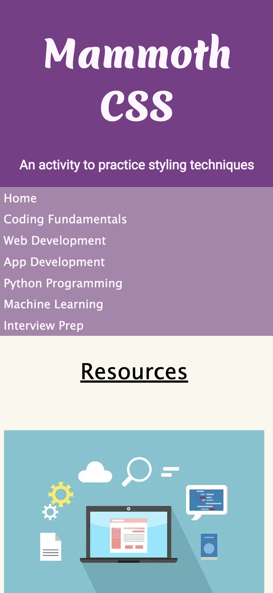

# Mammoth CSS

A coding tutorial created to review and practice CSS by styling a basic index.html file with an external style.css file. Completed through Mammoth Interactive at [link to Mammoth Interactive Homepage](https://training.mammothinteractive.com/courses).

## Tech Used
- HTML
- CSS

## Dependencies
None. Viewer only need to utilze Live Server through the index.html file.

## Uses
To practice and style a HTML file with CSS. This project offered some clarification on certain CSS consepts (padding vs. margin, id being unique vs. classes being reused, @media and -ms-flex)

## How I veered from the original project
- Changed the header and sub headers
- Created class names and id's to style certain elements
- Created my own color palette
- Created my own sidebar content

## History
After completing a Software Engineering certification program and during my job search, I needed to continue to pracitce my skill set in order to maintain it and learn more. I thought that even the most basic projects using the most basic languages was a great place to start.

